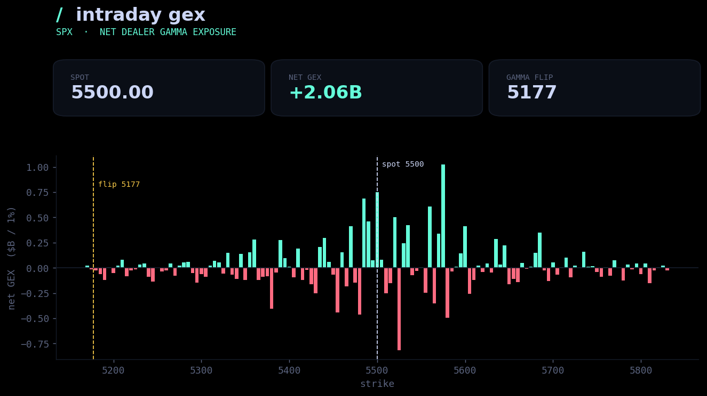

# Intraday GEX Dashboard

Real-time dashboard that tracks **net dealer gamma exposure (GEX)** across SPX
strikes through the trading day, and surfaces the **gamma flip** level — the
strike where dealer positioning crosses from net-long to net-short gamma.

Positive-gamma regimes tend to *pin* price (dealers sell rallies / buy dips);
negative-gamma regimes *accelerate* moves. Seeing where that flip sits, and how
the per-strike profile is shaped, is the whole point.




## Stack

```
backend/    Flask API (Python)
  app.py          /api/gex  + serves the built frontend
  gex.py          GEX per strike, net GEX, gamma-flip interpolation
  bs.py           Black-Scholes gamma (NumPy, no SciPy)
  marketdata.py   options-chain layer (synthetic by default; Schwab hook)
frontend/   React + Vite
  src/App.jsx           dashboard, polls /api/gex every 4s
  src/components/        GexChart (canvas), StatCard
  src/theme.css         site-matched dark/mint theme
```

## Run it

**Backend** (Flask API, port 5000):

```bash
cd backend
pip install -r requirements.txt
python app.py
```

**Frontend** (React dev server with hot reload, port 5173):

```bash
cd frontend
npm install
npm run dev          # opens http://localhost:5173, proxies /api to the backend
```

A production build is included in `frontend/dist`, so you can also just run the
backend and open **http://127.0.0.1:5000** — Flask serves the built React app
directly. To rebuild it: `cd frontend && npm run build`.

## Live data

No keys needed by default — it generates a realistic synthetic SPX chain. To
stream a real chain, implement `_from_schwab` in `backend/marketdata.py` and:

```bash
export SCHWAB_TOKEN=...
```

## API

`GET /api/gex` → `{ spot, net_gex, flip, strikes:[{strike, call_gex, put_gex, net_gex}] }`

## Notes

Educational tool, not trading advice.
